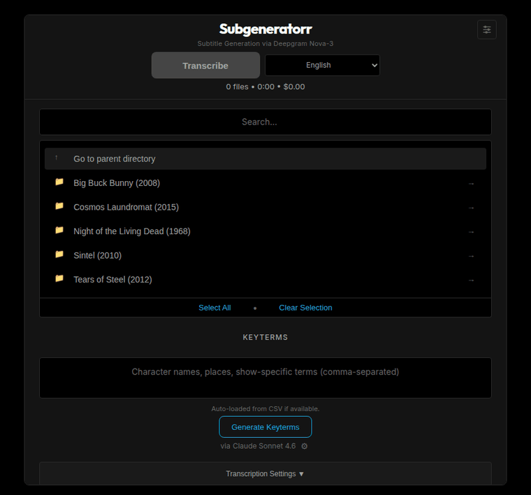
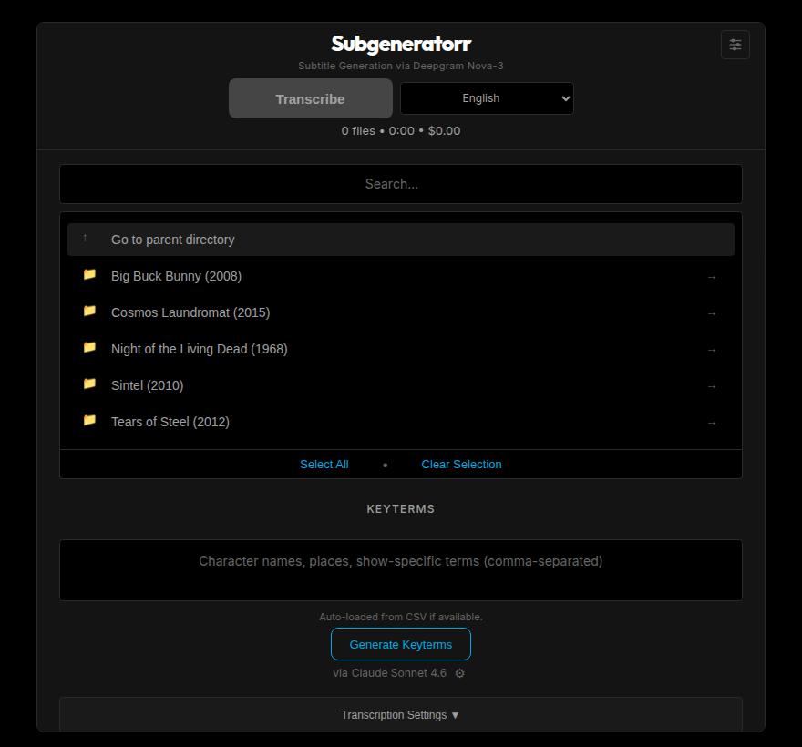
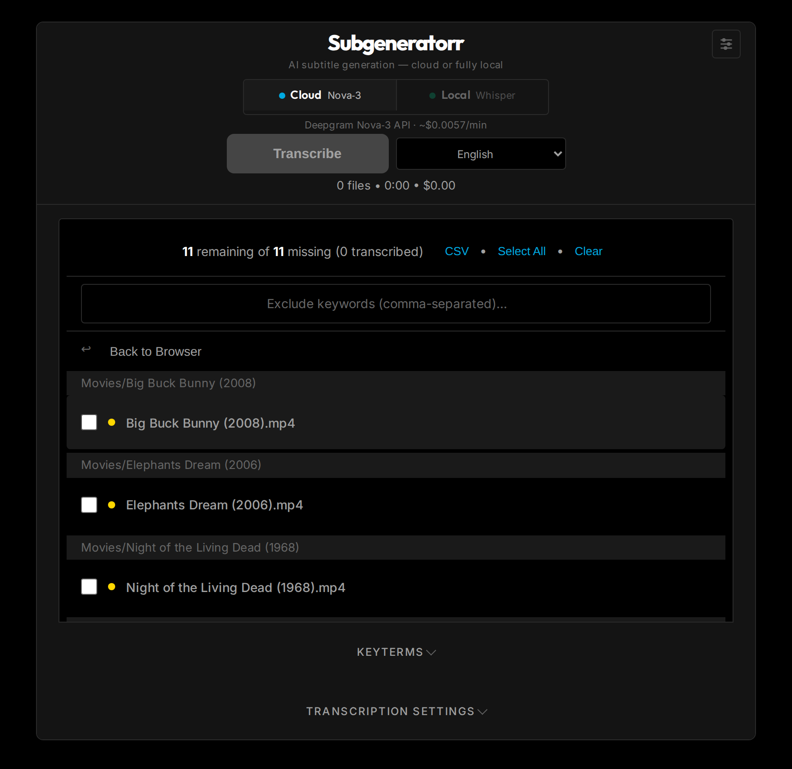
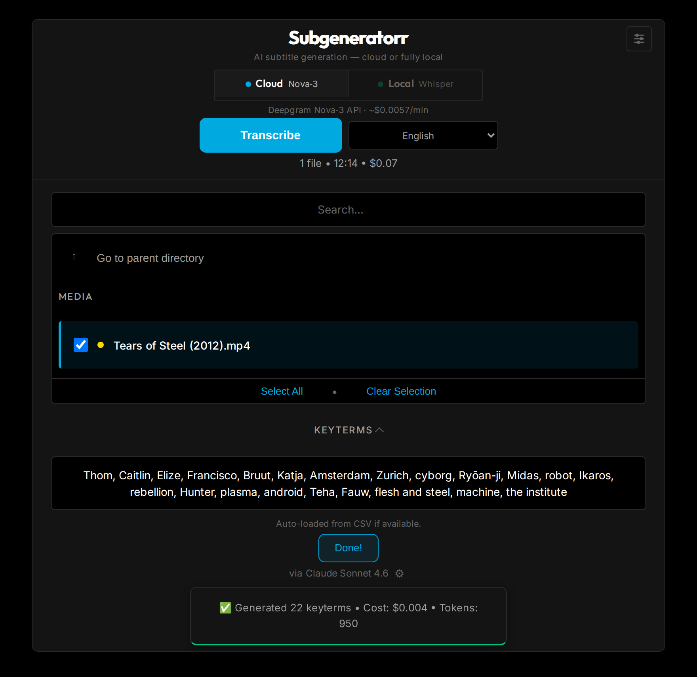
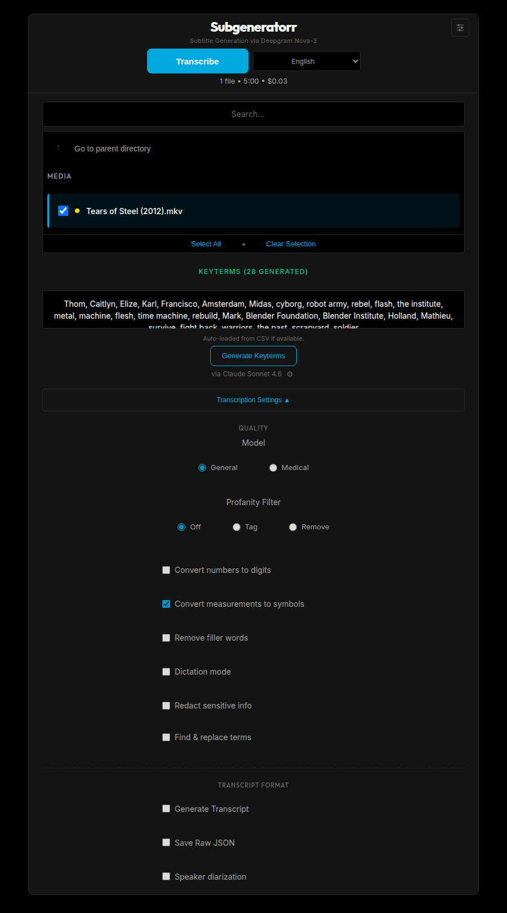
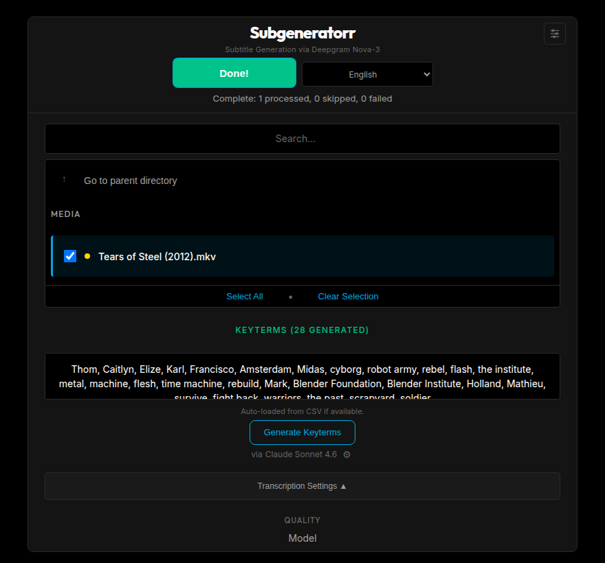

# Subgeneratorr

**Subtitle generation for Plex, Jellyfin, and Emby — cloud or fully local. Transcribe with Deepgram Nova-3 or an offline Whisper engine on your own hardware, then let Claude, GPT, Gemini, or a local Ollama model handle translation into 49 languages.**

[](https://www.docker.com/)
[](https://www.python.org/)
[](LICENSE)
[](https://github.com/tylerbcrawford/subgeneratorr/actions/workflows/ci.yml)
[](https://github.com/tylerbcrawford/subgeneratorr/releases/latest)
[](https://github.com/tylerbcrawford/subgeneratorr/pkgs/container/subgeneratorr-web)

<p align="center">
  
</p>

Subgeneratorr generates language-tagged SRT subtitles for the media [Bazarr](https://www.bazarr.media/) can't find — obscure shows, older episodes, anything without community subs. It runs as a Docker container with a Web UI and CLI, uses **keyterm prompting** so proper nouns come out right, and can translate every subtitle it makes into 49 more languages with the original timing preserved.

*I created it to fill the hundreds of missing-subtitle gaps in my own media library.*

## Cloud or local — you choose

Since v3, transcription is a per-job switch right on the main screen:

| | ☁️ **Cloud** — Deepgram Nova-3 | 🏠 **Local** — Whisper *(new in v3, beta)* |
|---|---|---|
| **Accuracy** | Best in class; keyterms boost proper nouns up to ~90% | ~89% word-level agreement with Nova-3 (`small` model) |
| **Speed** | ~1% of runtime | Near-real-time on a modest CPU (0.3× measured on an N100) |
| **Cost** | ~$0.0057/min, [$200 free credits](https://console.deepgram.com/) (~585 hrs) | **$0, forever** |
| **Privacy** | Audio goes to Deepgram's API | **Nothing leaves your machine** |
| **Setup** | API key | No account, no key; larger image with the model baked in |
| **Extras** | Diarization, redaction, audio intelligence | Core transcription (cloud-only options hide automatically) |

Every AI step after transcription (keyterms, translation) is provider-agnostic too: Claude, GPT, Gemini, or a local **Ollama** model — pair Local Whisper with Ollama and the entire pipeline runs offline at $0, with no vendor lock-in anywhere.

> Free and open-source. Not affiliated with Deepgram, Anthropic, OpenAI, or any other provider.

---

## Features

- 🎯 **Deepgram Nova-3 speech-to-text** — strong on fast dialogue, accents, and 40+ transcription languages (50+ counting regional variants; General + Medical models)
- 🏠 **Local engine (v3)** — opt-in `-local` images transcribe on your own hardware via faster-whisper: CPU-only, offline, $0, default model baked in
- 🔑 **Keyterm prompting** — feed character names, locations, and jargon to Nova-3 for up to ~90% better accuracy on proper nouns; generate them with one click via Claude, GPT, or Gemini
- 🌐 **Subtitle translation into 49 languages** — turn one transcription into many: an LLM translates the generated SRT with timing preserved and writes tagged sidecars Plex, Jellyfin, and Emby pick up; use Claude, GPT, Gemini, or a local **Ollama** model for free offline translation
- 🔍 **Library-wide scan** — find every file missing subtitles across your whole library, grouped by folder, with CSV export
- 🗣️ **Speaker diarization** — labeled, character-named transcripts
- 🌍 **Multilingual transcription** — auto-detect, `multi` code-switching, and regional variants across 50+ Nova-3 language codes
- 🛡️ **Content control** — redaction (PCI/PII), profanity filtering, find & replace, dictation
- 🧠 **Audio intelligence** — sentiment, summarization, topic/intent/entity detection (English)
- 🐳 **Docker-based** — Web UI and CLI, batch processing with parallel workers and real-time progress
- 📺 **Media-server ready** — language-tagged sidecars (`.eng.srt`, `.spa.srt`, `.und.srt`) auto-recognized by Plex, Jellyfin, and Emby

---

## Screenshots

<p align="center">
  <br>
  <sub>Browse your media library.</sub>
</p>

<p align="center">
  <br>
  <sub>Scan the whole library for missing subtitles, grouped by folder.</sub>
</p>

<p align="center">
  <br>
  <sub>One-click AI keyterms — here it read the filename and pulled 28 terms from <em>Tears of Steel</em> on its own.</sub>
</p>

<p align="center">
  <br>
  <sub>Full control over Nova-3 settings when you want it; sensible defaults when you don't.</sub>
</p>

<p align="center">
  <br>
  <sub>Watch progress per file and confirm each subtitle as it lands.</sub>
</p>

<sub>Demo library uses Creative Commons / public-domain titles (Blender open movies, Pioneer One, Night of the Living Dead) so nothing copyrighted appears in the shots.</sub>

---

## Quick Start (~10 minutes)

**Pick your flavor:**

- ☁️ **Cloud (default)** — Deepgram Nova-3: best accuracy, processes in ~1% of runtime, ~$0.0057/min with [$200 free credits](https://console.deepgram.com/). Needs an API key.
- 🏠 **Fully local** — faster-whisper on your CPU: $0, offline, no account or key needed, near-real-time processing (larger image). Both engines stay selectable per job.

**Requirements:** Docker + Docker Compose · media files (MKV, MP4, AVI, MOV, MP3, WAV, FLAC, …) · a [Deepgram API key](https://console.deepgram.com/) for the cloud flavor only

```bash
git clone https://github.com/tylerbcrawford/subgeneratorr.git
cd subgeneratorr

cp .env.example .env
cp examples/docker-compose.example.yml docker-compose.yml          # ☁️ cloud (default)
# cp examples/docker-compose.local.example.yml docker-compose.yml  # 🏠 fully local

# In .env, set:
#   MEDIA_PATH=/path/to/your/media
#   DEEPGRAM_API_KEY=your_key_here   # ☁️ cloud flavor only

docker compose build
docker compose up -d          # Web UI at http://localhost:5000
# ...or run headless:
docker compose run --rm cli   # processes the whole MEDIA_PATH library
```

> **Security:** `DISABLE_AUTH=true` is the default and is for local access only. For remote/production use, set `DISABLE_AUTH=false` and put an authenticating reverse proxy in front that forwards `X-Auth-Request-Email` or `X-Forwarded-User`. The CLI is synchronous and headless; the Web UI adds async batches, progress tracking, library scanning, and AI keyterm generation.

---

## How It Works

### Keyterm prompting

Speech models nail everyday words but mangle proper nouns — "Heisenberg" becomes "Heizenberg," "Los Pollos Hermanos" becomes gibberish. Keyterms tell Nova-3 exactly what to listen for, boosting recognition at decode time (not as post-processing). Up to ~90% accuracy improvement on prompted terms, ~20–50 terms per show.

Provide them manually as a CSV, or click **Generate Keyterms** in the Web UI: an LLM infers the show from the file path, researches it, and returns 20–50 names, locations, and jargon terms in 3–5 seconds for less than a penny. Gemini's free tier makes it effectively zero-cost, and the keyterms apply to every episode in the show automatically. See the [model benchmarks](docs/technical.md#ai-powered-generation) and [CSV format](docs/technical.md#keyterm-prompting-deep-dive).

### Translate subtitles

One transcription, many languages. After Nova-3 produces a subtitle, an LLM translates the cue text into the languages you pick and writes tagged sidecars (`.spa.srt`, `.fre.srt`, and so on) that Plex, Jellyfin, and Emby auto-detect. Timing is copied from the source frame for frame, so the translation never drifts, and the show's keyterms ride along as a glossary to keep names spelled consistently.

Open the **Translate** panel in the Web UI, pick your target languages, and choose a provider: Claude, GPT, Gemini, or a local **Ollama** model. Ollama runs on your own hardware over its OpenAI-compatible endpoint, so translation is free and fully offline (the cost estimate shows $0.00) — use a capable 3B+ model like `qwen2.5:7b` for reliable results. Existing translations are skipped unless you choose to overwrite.

### Run fully local (no cloud, $0)

The opt-in `-local` images swap Deepgram for [faster-whisper](https://github.com/SYSTRAN/faster-whisper) on CPU. The `small` model is baked in, so it works offline from first boot; bigger models download into a cache volume, and the model picker shows RAM/speed guidance for each.

Start from `examples/docker-compose.local.example.yml`, which builds web, worker, and CLI from the `local` target. No `DEEPGRAM_API_KEY` needed — without one the UI greys out the Cloud engine and defaults to Local. For headless runs, the `subgeneratorr-cli-local` image uses the same engine via `ASR_ENGINE=whisper`. Add Ollama for keyterms and translation and no audio, text, or API key ever leaves your machine.

On the standard image it's the reverse: Deepgram stays the default and Local shows as unavailable. Either way the engine is a per-job switch in the Web UI, preselected from your server's `ASR_ENGINE`.

One change to cloud output in v3: subtitle cues no longer embed `[speaker N]` tags by default — re-enable them with the "Speaker labels in subtitles" toggle (or `SPEAKER_LABELS=1` for the CLI).

### Find all missing subtitles

Point it at a library of thousands of files and it tells you exactly what's missing. A two-phase scan checks sidecar files (seconds), then optionally probes embedded tracks with ffprobe (~50–100ms/file). Results come back grouped by directory, persist across page reloads, and export to CSV. A 4,662-file library scans in ~6 minutes with embedded detection on, or in seconds in sidecar-only mode.

### The full library cleanup (the workflow I actually use)

1. **Scan** for missing subtitles (gear icon → "Find All Missing Subtitles")
2. **Review** results by directory to see which shows and seasons have gaps
3. **Generate AI keyterms** per show (one click, shared across all episodes)
4. **Select** files from the results → transcribe (keyterms auto-applied)
5. **Resume anytime** — scan results persist and processed files drop off the list

---

## Configuration

Two values are required; everything else has sensible defaults.

| Variable | Description | Default |
|----------|-------------|---------|
| `DEEPGRAM_API_KEY` | Deepgram API key (**required** for the cloud engine; optional with `ASR_ENGINE=whisper`) | – |
| `MEDIA_PATH` | Media directory to scan (**required**) | `/media` |
| `ASR_ENGINE` | `deepgram` (cloud) or `whisper` (local `-local` image) | `deepgram` |
| `WHISPER_MODEL` | Local model: `tiny` · `base` · `small` · `medium` · `large-v3` | `small` |
| `LANGUAGE` | Language code, or `auto` / `multi` | `en` |
| `ENABLE_TRANSCRIPT` | Generate speaker-labeled transcripts | `0` |
| `PROFANITY_FILTER` | `off` or `on` — masks profanity with asterisks | `off` |
| `ANTHROPIC_API_KEY` / `OPENAI_API_KEY` / `GEMINI_API_KEY` | AI keyterm generation and translation (optional) | – |
| `OLLAMA_HOST` | Local Ollama endpoint for free offline translation, e.g. `http://localhost:11434` (optional) | – |

`MEDIA_PATH` examples: `/home/you/media` (Linux), `/Users/you/Movies` (macOS), `C:/Users/You/Videos` (Windows). On Linux, set `PUID`/`PGID` to match your user so generated files keep the right ownership. Full reference: **[Technical docs](docs/technical.md#environment-variables-complete-reference)**.

---

## Pricing

Nova-3 costs ~**$0.0057/min** of audio:

| Content | Cost |
|---------|------|
| 10-min episode | ~$0.06 |
| 45-min episode | ~$0.26 |
| 90-min movie | ~$0.51 |
| 100 × 10-min episodes | ~$5.70 |

New Deepgram accounts get **$200 in free credits** — roughly 35,000 minutes (~585 hours).

---

## Documentation

- **[Technical docs](docs/technical.md)** — architecture, API endpoints, advanced config, speaker maps, AI model benchmarks
- **[Language support](docs/languages.md)** — the full Nova-3 transcription matrix (50+ with variants) and the 49 translation targets
- **[Roadmap](docs/roadmap.md)** — planned features

<details>
<summary><strong>FAQ</strong></summary>

**How is this different from Bazarr?**
Bazarr finds *existing* community subtitles; Subgeneratorr *generates* them from audio for whatever Bazarr can't find. Run Bazarr first, then Subgeneratorr on the gaps.

**Cloud or local — which engine should I pick?**
Cloud (Nova-3) for the best accuracy and speed at ~$0.0057/min; Local (Whisper) for $0, offline, fully private transcription at near-real-time speed. It's a per-job switch, so you can use both — see the [comparison table](#cloud-or-local--you-choose).

**What is keyterm prompting?**
A list of show-specific terms (character names, places, made-up words) that Nova-3 prioritizes during transcription — up to ~90% better accuracy on those terms.

**Does it work with Plex, Jellyfin, and Emby?**
Yes — it writes language-tagged SRT sidecars (`.eng.srt`, `.spa.srt`, etc.) that all three auto-detect. Refresh your library after generation.

**Can I auto-generate keyterms?**
Yes — one-click generation via Claude, GPT, or Gemini infers the title from the file path and returns 20–50 terms. Gemini's free tier makes it effectively free.

**Can it translate subtitles?**
Yes — after transcription, an LLM translates the cue text into any of 49 languages and writes tagged sidecars (`.spa.srt`, `.fre.srt`, …) with the original timing preserved. Use Claude, GPT, Gemini, or a free local Ollama model. See [Translate subtitles](#translate-subtitles).

**What languages are supported?**
Nova-3 transcribes 40+ languages (50+ counting regional variants), with auto-detect and a `multi` code-switching mode. Translation then covers 49 target languages. See the [language guide](docs/languages.md).

</details>

<details>
<summary><strong>Troubleshooting</strong></summary>

**Files being skipped** — Files are skipped only when all requested outputs already exist (`.eng.srt`, the matching language tag, or `.und.srt` for auto/multi). Set `FORCE_REGENERATE=1` to overwrite.

**Permission errors (Linux)** — Set `PUID`/`PGID` (from `id -u` / `id -g`) on all three services (cli, web, worker) so they share ownership.

**API errors** — Verify the key in `.env` and check your balance at the [Deepgram Console](https://console.deepgram.com/).

**"Local whisper engine is not installed" (400)** — You're running the standard (Deepgram-only) image. Deploy the `-local` images — start from `examples/docker-compose.local.example.yml` — to enable the Local engine.

**Keyterms not loading** — Confirm the path `{Show}/Transcripts/Keyterms/{ShowName}_keyterms.csv`, UTF-8 encoding, and that the filename matches the show directory exactly.

**Docker networking** — If `docker compose build` hangs at the APT layer or containers can't resolve DNS on the default bridge (but `--network host` works), use the Linux host-network override:
```bash
docker compose -f docker-compose.yml -f examples/docker-compose.hostnet.override.yml up -d --build
```

</details>

---

## Contributing

Issues and pull requests welcome — see [CONTRIBUTING.md](CONTRIBUTING.md). For local tests you don't need Docker or API keys: `make test`.

## License

MIT — see [LICENSE](LICENSE).

## Acknowledgments

Built on [Deepgram](https://deepgram.com/) (Nova-3, [Python SDK](https://github.com/deepgram/deepgram-python-sdk), [captions](https://github.com/deepgram/deepgram-python-captions)), [faster-whisper](https://github.com/SYSTRAN/faster-whisper) by SYSTRAN (the local engine), and [Claude Code](https://claude.com/claude-code).
